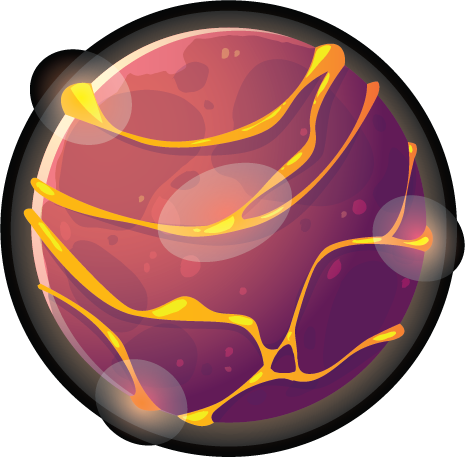

<!-- PROJECT LOGO -->
<br />
<div>
  <div align="center">
    <h1 style="font-weight: bold">Dark Planet 🌎</h1>
    <a href="https://github.com/DarkPlanets/DarkPlanets-Frontend">
        
    </a>
    <p align="center" style="margin-top: 30px">
        Dark Planet frontend provides an interface for players to easily interact with the Dark Planet game. Dark Planet is a planetary game based on Rarity. Rarity is a planetary inhabitant. This is a world fighting for energy.This is the v1.0 version.
        <br />
        <a href="https://github.com/DarkPlanets/DarkPlanets-Frontend/issues">Report Bugs</a>
        ·
        <a href="https://github.com/DarkPlanets/DarkPlanets-Frontend/issues">Request Feature</a>
    </p>
  </div>
</div>

<!-- TABLE OF CONTENTS -->

## Table of Contents

- [About the Project](#about-the-project)
  - [Built With](#built-with)
- [Getting Started](#getting-started)

<br />

<!-- ABOUT THE PROJECT -->
<h2 align="center"> About The Project </h2>

<p>Dark Planet frontend provides an interface for players to easily interact with the Dark Planet game. Dark Planet is a planetary game based on Rarity. Rarity is a planetary inhabitant. This is a world fighting for energy.This is the v1.0 version.</p>

<br />

<!-- GETTING STARTED -->

## Getting Started

This is an example of how you can set up your project locally. To get a local copy up and running follow these simple example steps.

1. Clone the repo

```sh
git clone with HTTPS          https://github.com/DarkPlanets/DarkPlanets-Frontend.git
git clone with SSH            git@github.com:DarkPlanets/DarkPlanets-Frontend.git
git clone with Github CLI     gh repo clone DarkPlanets/DarkPlanets-Frontend
```

2. Development

```sh
1. yarn install           # Install dependencies for project
2. yarn dev             # Starts the app
```
